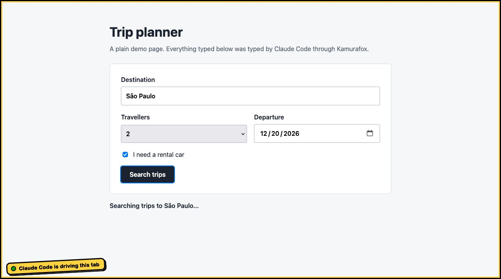
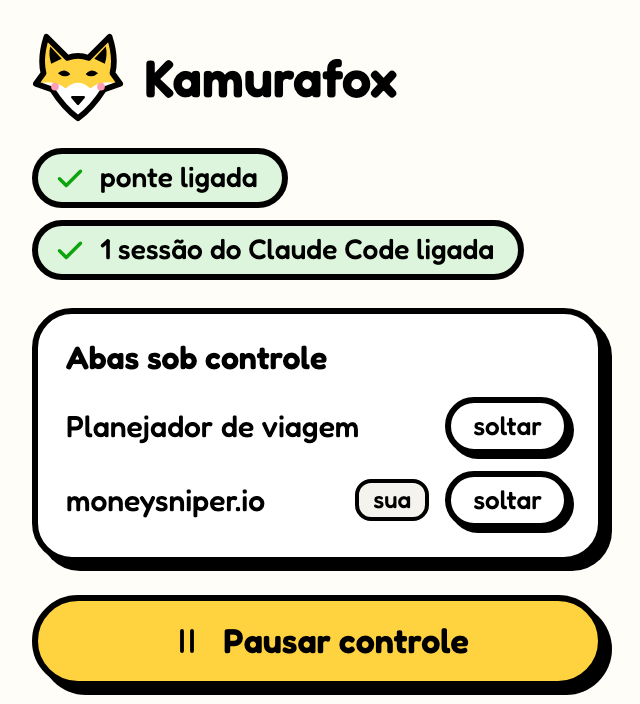

# Kamurafox

Deixa o Claude Code dirigir o Firefox: abrir aba, navegar, ler a página, clicar, digitar, tirar print, ver o console e a rede. É o que a extensão Claude in Chrome faz no Chrome, feito do zero para o Firefox.

Projeto não oficial. Não é da Anthropic nem da Mozilla.

<p>
  
  
</p>

## Como funciona

```
Claude Code ── MCP (stdio) ── mcp-server.js ── socket Unix ── native-host.js ── native messaging ── extensão
```

- `extension/`: a extensão. O código que lê e mexe na página só entra nas abas que o Claude controla.
- `bridge/native-host.js`: programa que o Firefox liga quando a extensão sobe. Abre um socket em `~/.kamurafox/sockets/`, com acesso só do seu usuário.
- `bridge/mcp-server.js`: servidor MCP que o Claude Code liga a cada sessão e que fala com o socket.

Nada sai para a rede: a conversa entre o Claude Code e o Firefox fica dentro do computador.

## Instalar

Precisa de Node 20 ou mais novo e Firefox 140 ou mais novo, em macOS ou Linux.

```sh
npm install      # só para desenvolver: traz o web-ext
npm run setup    # copia a ponte para ~/.kamurafox e registra no Firefox e no Claude Code
```

Depois carregue a extensão no Firefox:

- **Para testar agora:** abra `about:debugging#/runtime/this-firefox`, clique em "Carregar extensão temporária" e escolha `extension/manifest.json`. Ela some quando o Firefox fecha.
- **Firefox separado só para o Claude:** `npm run firefox` abre um Firefox com perfil próprio (`~/.kamurafox/profile`) e a extensão já carregada. Os logins feitos ali ficam guardados.
- **Para ficar de vez:** a extensão precisa ser assinada pela Mozilla (ainda não foi).

Abra uma sessão nova do Claude Code: as ferramentas aparecem como `mcp__kamurafox__*`.

## Ferramentas

| Ferramenta | O que faz |
| --- | --- |
| `tabs_context`, `tabs_create`, `tabs_adopt`, `tabs_close` | Lista, abre, assume e fecha abas |
| `navigate` | Vai para uma URL, volta, avança ou recarrega |
| `read_page`, `get_page_text`, `find` | Lê a estrutura da página, o texto, ou procura elementos por palavra-chave |
| `computer` | Print (com `show_mark` a moldura aparece na foto), zoom, clique, hover, digitar, teclas, rolagem, espera |
| `form_input` | Preenche campo, caixa de seleção ou lista |
| `javascript_tool` | Roda JavaScript na página |
| `read_console_messages`, `read_network_requests` | Console e rede da aba |
| `handle_dialogs`, `resize_window` | Resposta a `confirm`/`prompt` e tamanho da janela |

## Segurança

- O Claude só age nas abas que ele abriu, ou nas que você mandou assumir. Elas ficam num grupo "Claude" e ganham uma moldura preta e amarela com o aviso "Claude Code está dirigindo esta aba".
- Enquanto o Claude tem alguma aba, um script mínimo (`early.js`) roda no começo de cada página das outras abas só para perguntar "esta aba é controlada?". Se não for, ele se desfaz na hora e não lê nada da página. É o único jeito de gravar o console desde o primeiro instante nas abas controladas. Sem nenhuma aba sob controle, ele nem é registrado.
- O botão da extensão mostra as abas sob controle, solta qualquer uma e tem **Pausar controle**, que corta tudo na hora.
- Qualquer programa rodando com o seu usuário consegue falar com o socket. É o mesmo nível de confiança do Claude in Chrome.

## Limites conhecidos

O Firefox não dá a extensões o depurador que o Chrome dá, então mouse e teclado são eventos sintéticos do DOM:

- menu nativo de `<select>` não abre com clique (use `form_input`);
- seletor de arquivo, área de transferência e atalhos do próprio navegador ficam de fora;
- `:hover` de CSS puro não acende;
- conteúdo dentro de iframes ainda não é alcançado;
- páginas `about:`, `addons.mozilla.org`, o leitor de PDF e o modo leitura são bloqueados pelo próprio Firefox.

## Desenvolver

```sh
npm test        # teste de ponta a ponta num Firefox sem janela, com perfil descartável
npm run lint    # validador da Mozilla
npm run build   # gera o .zip em dist/
npm run remove  # desfaz o npm run setup
```

Mudou algo em `bridge/`? Rode `npm run setup` de novo: o Firefox usa a cópia em `~/.kamurafox`.

## Licença

GPL-3.0. A fonte Fredoka segue a SIL Open Font License (`extension/fonts/Fredoka-OFL.txt`). O visual está descrito em `docs/design.md`.
